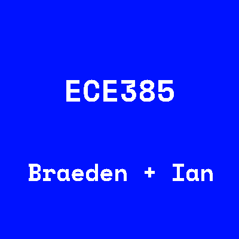
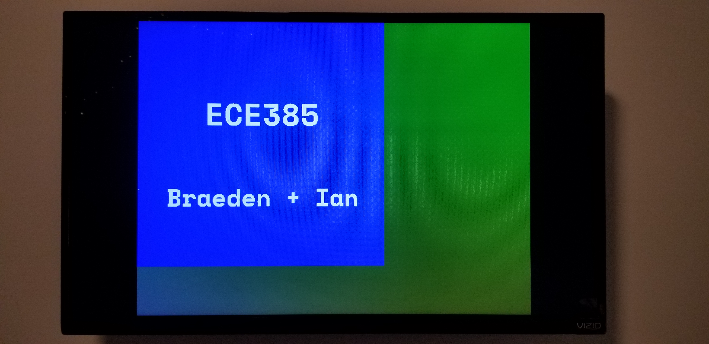
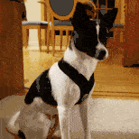
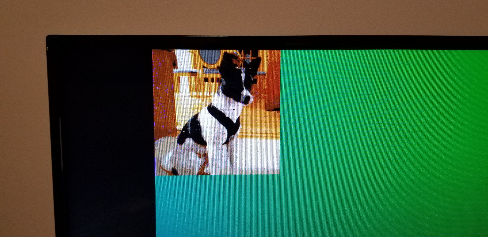
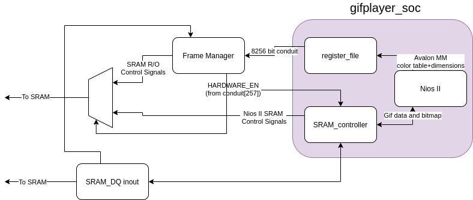

# UIUC ECE 385 - A .GIF decoder built for a DE2-115 development FPGA board




----------------------------------




---------------------------------

## [Animated video](https://drive.google.com/file/d/1Ys_Bvm4wdpAzSSFu5BOJIOafD7j1-tSv/view?usp=sharing)

# Resources:
https://www.matthewflickinger.com/lab/whatsinagif/bits_and_bytes.asp

https://commandlinefanatic.com/cgi-bin/showarticle.cgi?article=art011
- Source for `LZW.h`

https://en.wikipedia.org/wiki/GIF#File_format

# Setup:

```
cd gifplayer_1.0/software/test
main.c -> set ON_NIOS = 0; if developing locally

clang main.c -Wall -g -o test && ./test
```

# Stipulations:
- Gifs with even X Y dimensions seem are the only ones that fully display properly, there is a glitch accessing upper/lower bytes when using odd sizes
- The GIF size is severly limited based off of SRAM space and overflows of the address space when reading subsequent frames 
- ~10Kb gif size with ~1.2 Megabytes for decoded frames
- Some AEBs result in a failed assert and must be removed from the file
- There is a custom SRAM controller inside the synthesis folder, which must be restored if platform designer regenerates HDL
----------------------------------

